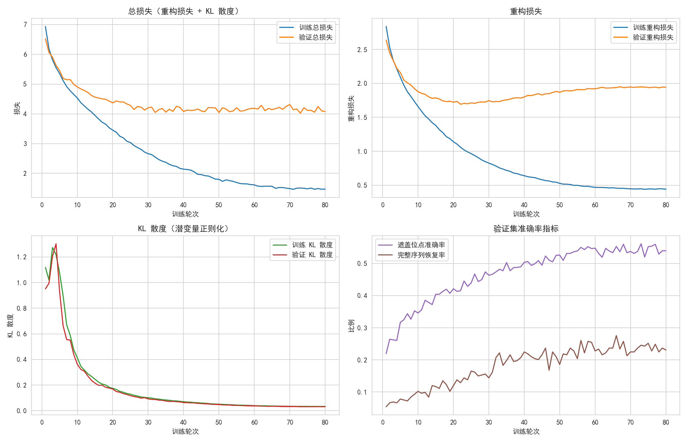
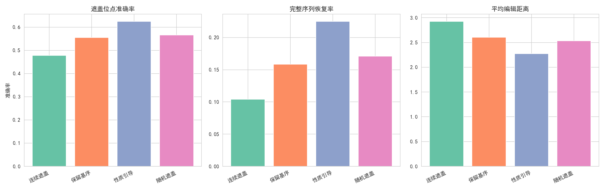
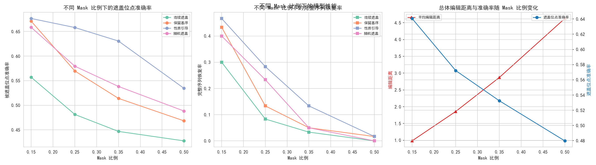
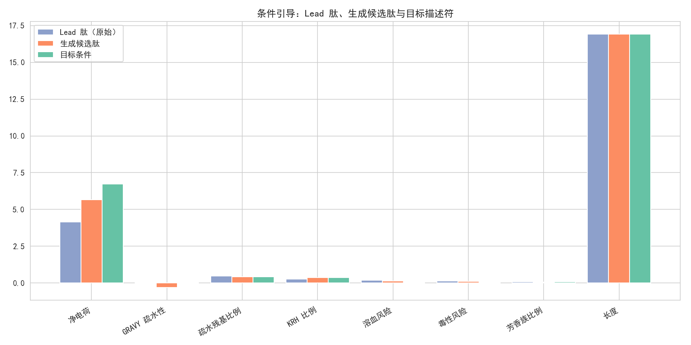
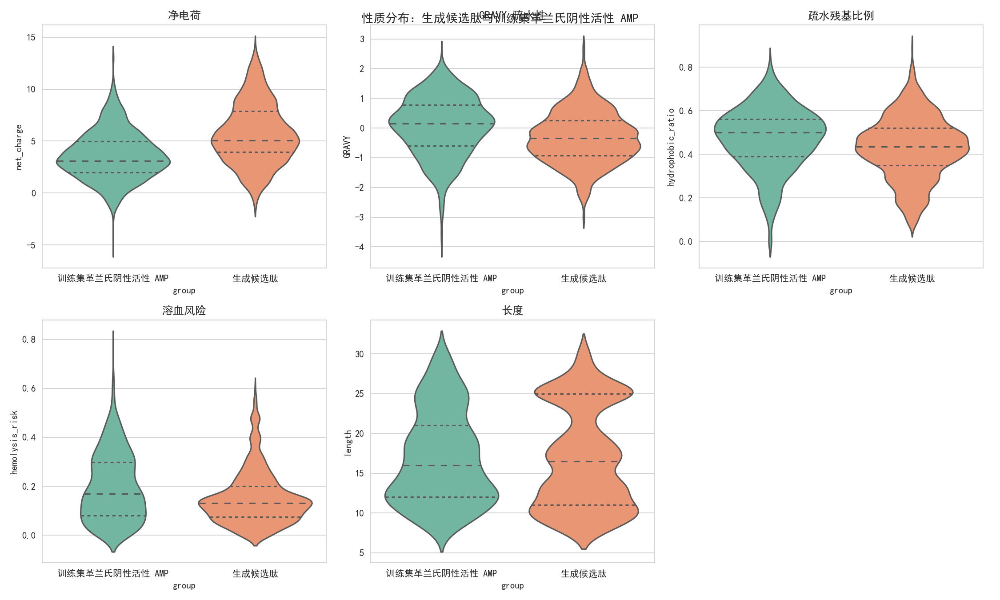
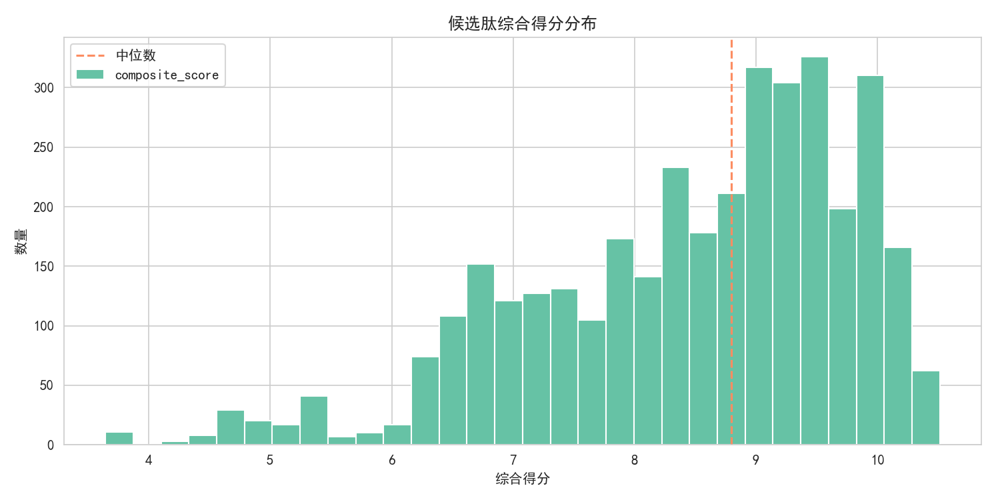

# 机制约束的抗革兰氏阴性菌多肽生成——训练与评估报告

> 本报告对应《深度学习入门5：生成模型》阶段实践，基于条件变分自编码器（Conditional VAE）实现 `机制描述符 + masked peptide sequence → original sequence` 的重构与条件优化生成。
> 项目状态：已完成可复现的训练/生成原型链路，尚未提供独立 wet-lab 实验验真证据。

## 1. 项目与任务回顾

### 1.1 任务定位
- **目标**：给定被部分遮盖的多肽序列（保留核心motif或可变位点mask），以及机制/理化描述符，模型恢复原始序列；推理时通过修改目标机制描述符引导生成更优候选。
- **输入**：(1) 机制相关描述符向量（20维）；(2) [MASK]遮盖的多肽序列骨架。
- **输出**：重构的完整多肽序列；以及优化生成的革兰氏阴性菌活性AMP候选列表。
- **模型**：条件VAE（CVAE），含 BiGRU Encoder + Attention Pooling + Latent Space + GRU Decoder；另有 encoder-side masked-token infill head 用于局部补全。

### 1.2 核心概念
1. **Masked Sequence Reconstruction**：将 [MASK] 作为单个序列 token，并用显式 masked-token head 预测被遮盖位点；CVAE seq2seq 分支保留完整序列生成能力。
2. **Mechanism-Conditioned Generation**：机制描述符（电荷/疏水/溶血/毒性/KRH等）作为条件嵌入，在latent空间与解码中控制方向。
3. **CVAE Latent Variable**：对 masked seq 的全局表示做变分正则化，保证生成多样性。
4. **Denoising Autoencoder 视角**：mask相当于噪声注入，模型从损坏的序列+条件中还原原序列。

## 2. 数据集构建

### 2.1 数据规模
- Train: **1245** 条 (阳性AMP=1087, 阴性=158)
- Val: **334** 条
- Test: **289** 条
- Independent lead/optimization split: **222** 条 (阳性=193)
- 平均长度: 17.0 aa, 平均净电荷: 3.67

### 2.2 数据来源
- **优先数据源**：当前工作区优先读取真实 DBAASP 文件 `data/dbaasp_dataset.csv`；若文件缺失则自动回退到合成数据生成路径。
- **当前已落盘的数据**：`dbaasp_dataset.csv` 共 2094 条记录、2090 条不同序列，其中 Gram-negative 活性正样本 1843 条、非活性负样本 251 条；划分前去掉4条重复序列。
- **划分方式**：先按序列去重，再在正、负标签内部各自采用80% identity的CD-HIT风格相似性聚类分割；train/val/test/lead四个split不共享完全相同序列。由于正负标签分别聚类，该原型不能严格排除跨标签高相似序列跨split，正式研究应使用全数据统一聚类审计。
- **长度范围**：训练与推理均聚焦 8–30 aa 的短肽区域，符合短 AMP 典型长度分布。

## 3. 机制相关描述符设计（20维）

围绕革兰氏阴性菌抗菌肽作用机制（LPS结合→外膜扰动→内膜插入→杀菌），构造6大类描述符：

| 类别 | 关键描述符 | 与G-菌抗感染关系 |
|---|---|---|
| **Sequence Scale** | length, molecular_weight, instability_index | 控制合成难度、肽稳定性、膜穿透效率 |
| **Charge/Cationic** | net_charge, KRH_ratio, positive_density | 阳离子性帮助与LPS及阴离子膜结合 |
| **Hydrophobic/Amphipathic** | GRAVY, hydrophobic_ratio, aliphatic_index, hydrophobic_moment | 影响膜插入/扰动与溶血毒性间平衡 |
| **Composition/Motif** | aromatic_ratio, repeat_ratio | 捕获W/F/Y插入与K/R motif；避免过度重复 |
| **Structure/Flexibility** | helix_propensity, turn_propensity, disorder_tendency, Boman_index | 两亲螺旋与柔性结合潜力；Boman指数估算膜结合能 |
| **Risk Descriptors** | hemolysis_risk, toxicity_risk, aggregation_propensity, gram_negative_active | 用于约束/降低红细胞毒性与聚集风险 |

> 描述符边界：当前20维基础版未加入完整20AA composition和显式K/R-rich motif计数；KRH ratio、positive density以及aromatic/repeat ratio是近似替代，后续可补强。

目标范围用于条件引导生成：
- 净电荷 4–9；GRAVY −0.4 至 +0.6；KRH比例 0.25–0.45
- 溶血风险 ≤ 0.4；毒性风险 ≤ 0.4；长度 10–25 aa

## 4. Mask 策略设计（4种）

为训练模型在不同研发场景下的补全能力，实现4类遮盖策略：

1. **random mask (15%–40%)**：随机遮盖，学习一般序列上下文。
2. **contiguous mask（目标3–8 aa）**：优先连续遮盖局部片段，实际长度受mask ratio和序列长度约束，模拟片段替换。
3. **motif_preserving mask**：优先遮盖非 K/R/F/W/Y 的可变位点（≥90%），仅10%允许遮盖核心motif，模拟 lead optimization。
4. **property_guided mask (进阶)**：逐位点打分，优先遮盖高疏水、高芳香、负电荷或重复位点，对应“风险位点改造”。

### 4.1 不同Mask策略的重构表现（测试集阳性样本）
| 策略 | 样本数 | Masked Token Acc | Full Seq Recovery | Avg Edit Dist |
|---|---|---|---|---|
| contiguous | 240 | 0.478 | 0.104 | 2.92 |
| motif_preserving | 240 | 0.556 | 0.158 | 2.60 |
| property_guided | 240 | 0.625 | 0.225 | 2.27 |
| random | 240 | 0.566 | 0.171 | 2.53 |

解读：
- 本次独立测试中 `property_guided` 的 mask 位点恢复率最高（0.625），不能把某一策略的优势泛化为固定结论。
- `contiguous` 通常更难，因为连续缺失会减少局部上下文；高 mask ratio 的下降趋势见4.2。
- `property_guided` 直接对应风险位点改造场景，适合用于 lead 优化候选生成。

## 5. 模型结构：Conditional VAE Seq2Seq

### 5.1 网络结构
```
[masked sequence indices] → Embedding + DescriptorConditionEmbedding 拼接
      ↓
BiGRU Encoder (2层, hidden=256, dropout=0.2)
      ↓ (Attention Pooling)
[mu, logvar] ∈ R^64  →  reparameterize  →  z ∈ R^64 (latent)
      ↓
[z] concat [Descriptor]  →  投影为 GRU Decoder 初始h0
      ↓
GRU Decoder (2层, hidden=256) + teacher forcing (训练)
      + encoder-side masked-token infill head (自由重构评估/lead局部优化)
      ↓
logits (vocab_size=25: [PAD/MASK/SOS/EOS/UNK] + 20 AA)
```

### 5.2 损失函数
$$\mathcal{L}_{total} = \mathcal{L}_{recon} + \lambda_{infill}\mathcal{L}_{masked} + \lambda_{kl}D_{KL}(q(z|x,c) \| \mathcal{N}(0,1))$$
- $\mathcal{L}_{recon}$：序列自回归交叉熵（忽略PAD）；$\mathcal{L}_{masked}$：仅在真实 [MASK] 位点计算的交叉熵
- masked-token loss weight = 1.5；$\lambda_{kl}$采用warmup（0.005→0.05，前1/3 epoch线性爬升）
- 训练细节：AdamW lr=1e-3, CosineAnnealing, grad clip=1.0, batch=64，目标 epochs=80。

## 6. 训练曲线

- 共训练 **80** epochs（`last_cvae.pt` epoch=80）；当前保存结果显示 final val_total=4.078, final val_recon=1.944, final val_kl=0.0315
- 最优 checkpoint epoch=73，最优 val_total = 4.023；最终 checkpoint 与最佳 checkpoint 分开保存。
- 验证 masked-token accuracy（显式 infill head）最终=0.540，最高=0.561（epoch 73）；full sequence recovery 最终=0.231，最高=0.275
- 独立测试集自由补全评估见第4.1节；保留未遮盖 scaffold，仅统计 mask 位点，不与训练期指标混用。

> 说明：当前结果属于模型原型，预测活性、溶血和毒性均为 in-silico 结果，不能替代 MIC/HC50/细胞毒性实验。







## 7. 推理与生成结果

### 7.1 生成质量指标

- Total candidates generated: **3600**
- Valid peptide rate (标准20AA + 长度合理): **100.00%**
- 说明：unique rate 在去重前的原始采样候选上计算；novel rate 表示不与训练集完全相同，仍不能替代实验新颖性。
- Unique rate (去重前有效集): **68.75%**
- Novel rate (不在训练集): **99.86%**
- Avg Nearest-Neighbor Sim (训练集top-3)：**0.455**
  (说明：NN相似性高=靠近训练分布，并非越低越好，应在 novel rate 与 结构合理性间平衡。)

### 7.2 MIC 分层活性预测评估

- Active: MIC ≤ 16 μg/mL, n=996; inactive: MIC ≥ 64 μg/mL, n=337。
- 全量拟合预测器的 MIC 分层诊断：active=0.502，inactive=0.317，ROC-AUC=0.758。该 AUC 不是独立测试性能，不能替代生成肽的真实 MIC。
### 7.3 条件引导能力（Lead→Generated vs Target）

| 性质 | Lead均值 | Gen均值 | Target均值 | Δ(Lead→Gen) | Guidance达成率 |
|---|---|---|---|---|---|
| net_charge | 4.160 | 5.667 | 6.724 | 1.506 | 58.76% |
| GRAVY | 0.058 | -0.308 | -0.054 | -0.365 | 326.07% |
| hydrophobic_ratio | 0.475 | 0.429 | 0.430 | -0.046 | 101.18% |
| KRH_ratio | 0.283 | 0.362 | 0.368 | 0.080 | 93.55% |
| hemolysis_risk | 0.187 | 0.152 | 0.040 | -0.035 | 24.01% |
| toxicity_risk | 0.134 | 0.107 | 0.040 | -0.027 | 28.72% |
| aromatic_ratio | 0.094 | 0.073 | 0.080 | -0.021 | 152.01% |
| length | 16.920 | 16.920 | 16.920 | 0.000 | - |

说明：Guidance达成率 = (生成−Lead)/(Target−Lead)。正且接近100%表示朝目标移动，但超过100%也可能表示过冲，不能单独视为更好。

### 7.4 Counterfactual 条件对照

| 条件 | n | Net charge | GRAVY | Hydrophobic ratio | Hemo risk | Activity probability | Synthesis feasibility |
|---|---:|---:|---:|---:|---:|---:|---:|
| default | 900 | 5.570 | -0.251 | 0.436 | 0.160 | 0.541 | 0.913 |
| higher_charge | 900 | 5.802 | -0.330 | 0.429 | 0.151 | 0.560 | 0.916 |
| lower_hemolysis | 900 | 5.599 | -0.280 | 0.436 | 0.155 | 0.549 | 0.914 |
| lower_hydrophobic | 900 | 5.696 | -0.369 | 0.416 | 0.142 | 0.566 | 0.916 |

### 7.5 性质分布统计距离

| 性质 | Train AMP 均值 | Generated 均值 | KS statistic | KS p-value | Wasserstein distance |
|---|---:|---:|---:|---:|---:|
| length | 16.944 | 16.920 | 0.115 | 5.12e-10 | 0.812 |
| net_charge | 3.639 | 5.667 | 0.322 | 3.33e-16 | 2.028 |
| GRAVY | 0.051 | -0.308 | 0.216 | 3.33e-16 | 0.375 |
| hydrophobic_ratio | 0.471 | 0.429 | 0.179 | 3.33e-16 | 0.043 |
| KRH_ratio | 0.273 | 0.362 | 0.286 | 3.33e-16 | 0.091 |
| aromatic_ratio | 0.106 | 0.073 | 0.159 | 3.33e-16 | 0.033 |
| hemolysis_risk | 0.196 | 0.152 | 0.201 | 3.33e-16 | 0.046 |
| toxicity_risk | 0.117 | 0.107 | 0.068 | 0.000929 | 0.011 |

### 7.6 相对 lead 的优化变化

| 指标 | Lead 均值 | Generated 均值 | Generated - Lead |
|---|---:|---:|---:|
| activity_probability | 0.474 | 0.554 | 0.080 |
| hemolysis_risk | 0.187 | 0.152 | -0.035 |
| toxicity_risk | 0.134 | 0.107 | -0.027 |
| synthesis_feasibility | 0.895 | 0.915 | 0.020 |





### 7.7 Top-10 候选AMP（综合Score排序）

| # | composite_score | predicted_activity | hemolysis_risk | toxicity_risk | novelty | nearest_neighbor_similarity | length | net_charge | GRAVY | sequence |
|---|---|---|---|---|---|---|---|---|---|---|
| 1 | 10.512 | 0.816 | 0.136 | 0.054 | 1.000 | 0.404 | 17 | 6.996 | -0.153 | KVWKKIASIGKKVLKKL |
| 2 | 10.505 | 0.768 | 0.093 | 0.037 | 1.000 | 0.353 | 17 | 6.996 | -0.394 | KKWKKFASIGKKVLKAL |
| 3 | 10.493 | 0.817 | 0.129 | 0.052 | 1.000 | 0.511 | 12 | 5.998 | -0.083 | VRLRRIVRVIRK |
| 4 | 10.465 | 0.788 | 0.111 | 0.044 | 1.000 | 0.392 | 17 | 6.996 | -0.294 | KKWKKIASIGKKVLKAL |
| 5 | 10.465 | 0.788 | 0.111 | 0.044 | 1.000 | 0.353 | 17 | 6.996 | -0.294 | KKWKKIASIGKAVLKKL |
| 6 | 10.464 | 0.804 | 0.139 | 0.056 | 1.000 | 0.447 | 19 | 7.997 | -0.242 | IGKVVRRFGSRIKKFLRKL |
| 7 | 10.456 | 0.691 | 0.096 | 0.038 | 1.000 | 0.471 | 17 | 5.996 | -0.271 | KNWKKIASILKKVGKAL |
| 8 | 10.455 | 0.686 | 0.092 | 0.037 | 1.000 | 0.412 | 17 | 5.996 | -0.294 | KNWKKIASILKKLGKAL |
| 9 | 10.441 | 0.811 | 0.125 | 0.050 | 1.000 | 0.472 | 12 | 5.998 | -0.108 | RRLRIRVRVVVK |
| 10 | 10.432 | 0.827 | 0.138 | 0.055 | 1.000 | 0.473 | 12 | 5.997 | -0.033 | VRLKRIVRVIRK |

## 8. 生成案例分析

### 8.1 结果解读
- 独立测试集上，property-guided mask 的 mask 位点恢复率最高（见4.1表）；mask ratio 从0.15升至0.50时恢复率下降，符合局部上下文信息减少的预期。
- 候选生成固定 lead scaffold，仅在 mask 位点采样，因此 edit distance 反映局部优化幅度，而不是从零生成距离。

### 8.2 失败/限制案例
- contiguous mask 和高 mask ratio 的恢复率仍明显低于随机/风险位点 mask，长连续片段补全仍是主要短板。
- 新 counterfactual 结果显示电荷、KRH 比例和 hydrophobic ratio 有方向响应，但 GRAVY 和 hydrophobic ratio 存在过冲，溶血/毒性风险仅部分下降，不能宣称多目标控制已完全解决。
- 预测器存在误差，候选必须经过 MIC、HC50 和细胞毒性实验确认。

## 9. 评估指标总览

| 维度 | 指标 | 本实验实际结果 |
|---|---|---|
| **重构能力** | Masked Token Acc / Seq Recovery / Edit Dist | 见4.1表，采用确定性 greedy 解码并保留未遮盖骨架位点
| **条件利用** | 目标性质偏移方向一致率 | 见7.2表；若字段缺失则明确标记为不可评估
| **生成质量** | Valid/Unique/Novel/NN-Sim | 见7.1实际统计；NN similarity 仅表示与训练分布的接近程度
| **抗菌相关性质** | 分布与Train G- Active AMP相似度 | 见7.5统计距离表和性质图；部分性质存在显著分布偏移
| **优化效果** | vs Lead：活性/溶血/毒性/合成可行性 | 见7.6相对lead表，仅为模型代理指标，不替代MIC/HC50实验
| **扩散模型** | 本任务主模型为CVAE；mask体现去噪自编码器思想，但未实现peptide diffusion，因此不报告扩散模型性能 |

## 10. 思考与总结

### 10.1 学到了什么
1. **从“小分子”到“多肽序列”的生成建模迁移**：两者都可token化，但多肽需要更显式的理化约束（电荷/疏水），条件建模更有效。
2. **机制约束比纯数据驱动更可控**：纯语言模型易生成形式合理但机制不匹配的序列；描述符条件让生成具有可解释方向。
3. **Mask策略是任务设计的核心**：不同mask对应不同研发场景（骨架保留/片段替换/风险位点改造），任务loss本身即是“预训练的课程学习”。
4. **VAE的正则化作用**：无KL时，重构可能略高但生成多样性差（重复/模式坍塌）；适度KL能在合理分布内探索更多候选。

### 10.2 限制与改进方向
1. **数据集规模**：当前数据来自落盘的DBAASP子集，仍需扩大到更大规模并用独立外部集验证泛化；可用预训练ESM-2/TAPE特征。
2. **模型升级**：GRU→Transformer；显式结构（α-螺旋两亲性）约束加入latent或loss；引入reinforce基于活性/毒性oracle。
3. **采样与筛选管线**：重复惩罚、beam search + 多目标Pareto筛选、分子动力学膜结合验证，构建AMP研发闭环。
4. **真实湿实验对接**：对Top候选做合成与MIC测定（大肠杆菌/铜绿假单胞），再迭代微调模型。

### 10.3 交付物清单
- [x] 代码：`data/`, `descriptor_calculator.py`, `mask_strategies.py`, `cvae.py`, `train.py`, `generate.py`, `evaluate.py`, `validate_candidates.py`
- [x] 结果：`results/generated_candidates.csv`（含sequence/descriptor/predicted_activity/hemolysis/toxicity/novelty/NN sim）
- [x] 可视化：`plots/training_curves.png`, `mask_strategy_comparison.png`, `condition_guidance.png`, `property_distribution.png`等
- [x] 报告：本文件 `results/REPORT.md` + `results/evaluation_metrics.json`